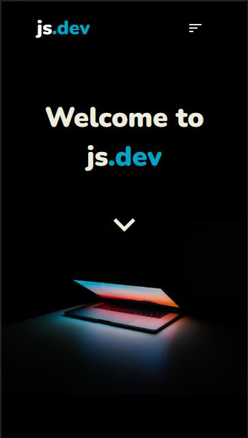
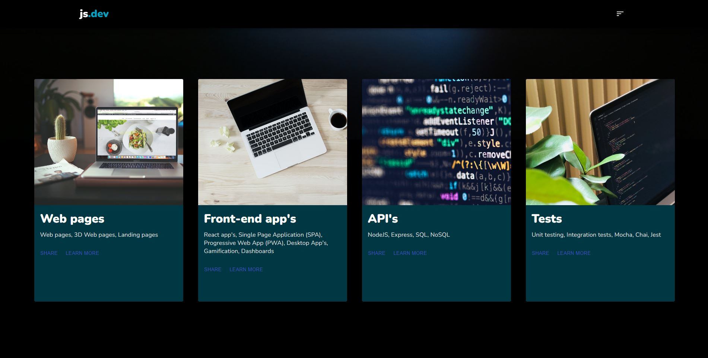

<div style="text-align:center">
<h1 style="align:center"><i>js.dev web site</i></h1>
<h3 style="align:center">minimalist web site template</h3>

|| <p style="align:center"> . [About](#about) . [Folder Structures](#folder-structures) . [Libraries & Frameworks](#libraries) . [Installation & Set Up](#installation) . [Start and Available Scripts](#start-and-available-scripts) . [License](#license) . [Thanks](#thanks) . </p> ||
|-|:-:|-:|

  

</div>

This project was bootstrapped with [Create React App](https://github.com/facebook/create-react-app).

## About

js.dev is a minimanilist website created with the duo *react&material-ui* and that can be used as a template.

## Folder Structures

```bash
+--- public
+--- src
     +--- assets
     +--- components
     +--- hooks
     +--- static
          +--- dataClient
               +--- design
               +--- products
               +--- themes
```
<span id="libraries"></span>
## Libraries & Frameworks

|Name| Description|
|-|-|
|[React.js](https://reactjs.org/)|React.js is a free and open-source front-end JavaScript library for building user interfaces or UI components.|
|[React Scroll](https://www.npmjs.com/package/react-scroll) |React component for animating vertical scrolling.|
|[Material-ui](https://material-ui.com/) |React components for faster and easier web development. Build your own design system, or start with Material Design.|
|[Nodemon](https://www.npmjs.com/package/nodemon/) | A tool that helps develop node.js based applications by automatically restarting the node application when file changes in the directory are detected.|


<span id="installation"></span>
## Installation & Set Up

##### - Cloning the project
```bash
git clone https://github.com/johnsonsudre/js.dev.git
cd js.dev
```

##### - Install project dependencies

```bash
  npm install or yarn install
```

#### Start and Available Scripts

In the project directory, you can run:

### `npm start`

Runs the app in the development mode.\
Open [http://localhost:3000](http://localhost:3000) to view it in the browser.

The page will reload if you make edits.\
You will also see any lint errors in the console.

### `npm run build`

Builds the app for production to the `build` folder.\

### `npm run eject`

**Note: this is a one-way operation. Once you `eject`, you can’t go back!**

## License

MIT © [Johnson Sudré](https://github.com/johnsonsudre)

## Thanks

#### [Unsplash: Beautiful Free Images & Pictures](https://unsplash.com/)
- *[Ales Nesetril](https://unsplash.com/@alesnesetril)*
- *[Carlos Muza](https://unsplash.com/@kmuza)*
- *[Emil Priver](https://unsplash.com/@emilpriver)*
- *[Igor Miske](https://unsplash.com/@igormiske)*
- *[Markus Spiske](https://unsplash.com/@markusspiske)*
